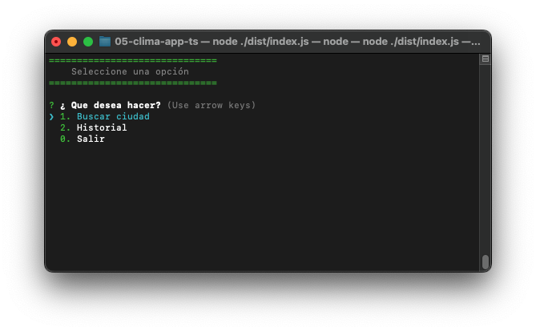
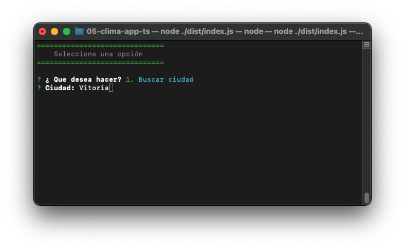
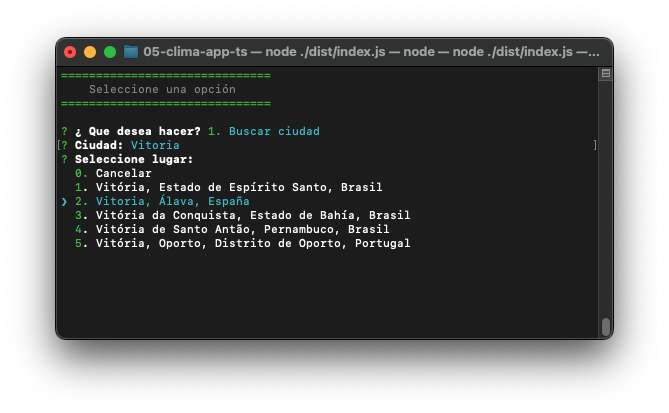
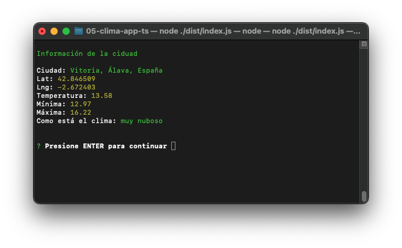
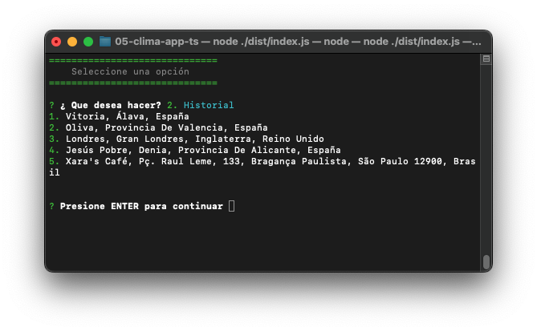

### App Clima en NodeJS
***
#### Descripción:
Aplicación de consola en la cuál podemos buscar un lugar y nos muestra el clima actual.
Se ha construido con TypeScript.

### Aplicación
Menú principal

Búsqueda ciudad

Selecionar búsqueda

Clima actual

Historial



## Instalaciones necesarias
1. Tener sus propias ApiKey de:

* [Mapbox](https://docs.mapbox.com/)
* [OpenWeather](https://home.openweathermap.org/)
 
2. Configurar archivo .env
```
MAPBOX_KEY=Aquí va la API_KEY de mapBox
OPENWEATHER_KEY=Aquí va la API_KEY de openWheather
``` 

3. Descargar las siguientes dependencias
```
  "dependencies": {
    "axios": "^0.20.0",
    "colors": "^1.4.0",
    "dotenv": "^16.0.2",
    "inquirer": "^7.3.3"
  },
```

4. Ejecución de app   
Se debe ejecutar del directorio de dist
```
05-clima-app-ts git:(main) ✗ node ./dist/index.js
```